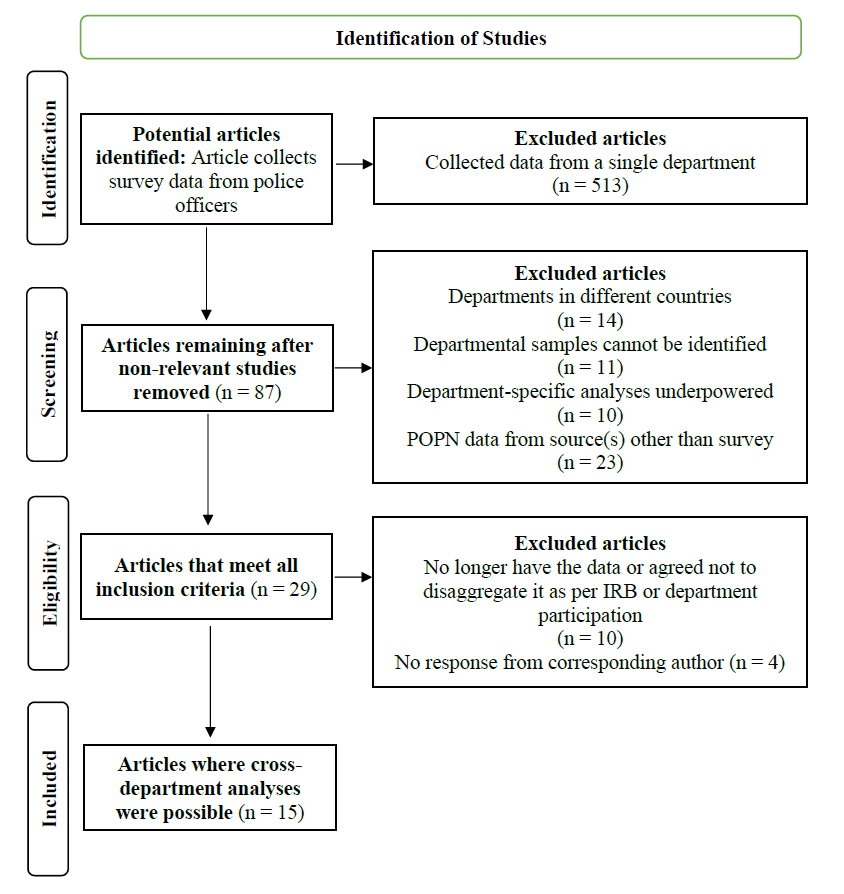
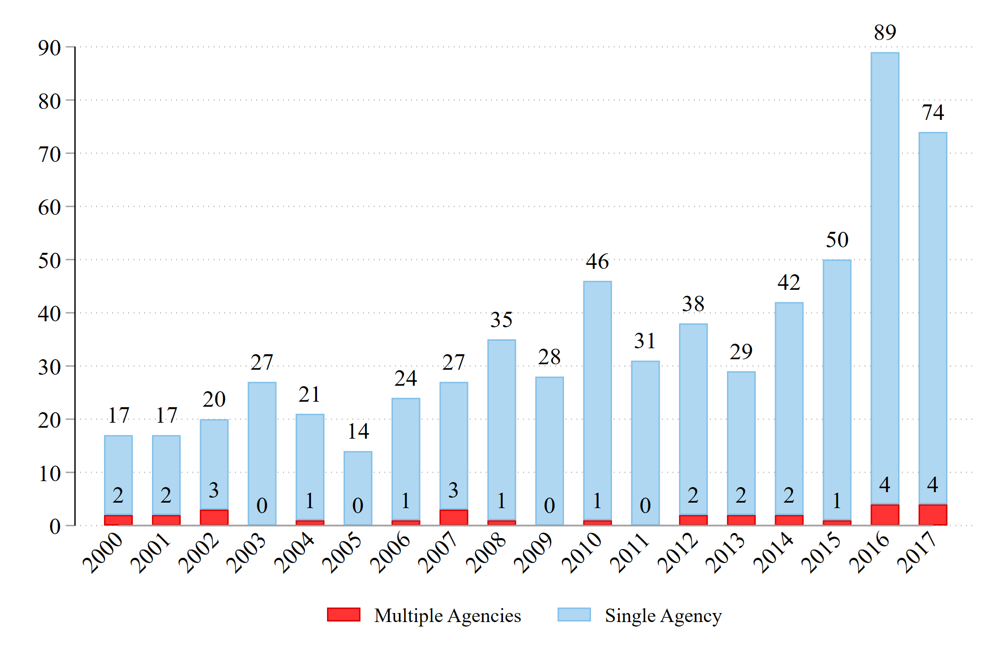

*(Re-posted from Dr. Nix's [website](https://jnix.netlify.app/publication/53-generalizability/))*

**Background**

Like 5 years ago, [Erin Kearns](https://www.unomaha.edu/ncite/staff-directory/erin-kearns.php) and I set out to answer two relatively simple questions: 

1. *How often do police researchers administer their surveys to officers in more than one agency?* 

2. *When researchers do survey officers in more than one agency, how often are results consistent across agencies?*

Erin had recently published [this paper](https://doi.org/10.1080/07418825.2017.1380837) in *Justice Quarterly*, where she administered surveys about community policing to officers in three departments. Afterward, she noted her conclusions would have been quite different if she'd only administered her survey to one department.

**Method**

To answer our questions, we looked at studies published between 2000 and 2017 in 16 criminology/policing journals (the same sampling frame my colleagues and I used for [this paper](https://doi.org/10.1080/10439463.2017.1394300) on response rates). One limitation of our approach is that we probably missed some studies where authors surveyed just one agency in an effort to replicate an existing study.[^1] However, we believe such studies are likely rare because they are disincentivized. Over in economics, for example, [Galiani et al. (2017, p. 2)](https://www.nber.org/papers/w23576) recently reported that "In a survey of editors, almost all responded they would in principle publish a replication study that overturned the results of the original study, but only 29% responded that they would consider publishing a replication study that confirmed the original study results." And in criminology, it has been estimated that replication studies make up somewhere between [0.45%](https://doi.org/10.1146/annurev-criminol-032317-091849) and [2.34%](https://doi.org/10.1177/1477370815578197) of the published literature. 

**Results**

Ultimately, we identified 600 studies that involved surveying one or more police departments. Just 87 of them surveyed more than a single department. After excluding studies that didn't meet our inclusion criteria (see below), we were left with 29 studies. Finally, for 15 of those 29 studies, we were able to scrape the information needed (or contact the authors to obtain it) for our analysis.

The answer to our first question, then, was that just 14.5% of the 600 police survey studies published in these 16 journals from 2000 to 2017 involved more than one department. Here's what it looks like when we plot the years:

The answer to our second question wasn't quite as straightforward. One study ([this one](https://doi.org/10.1108/PIJPSM-08-2016-0128)) fully replicated. Another ([this one](https://doi.org/10.1080/07418825.2017.1334808)) mostly replicated. Most of the others were decidedly mixed - see Table 2 of our [post-print](https://jnix.netlify.app/files/pdfs/ppr_generalizability.pdf) for detailed discussion. 

**Bottom Line**

Researchers (ourselves included) are often quick to point out the heterogeneity in American policing, which is comprised of some 18,000 agencies. Thus, we have to be careful when we interpret the results of studies involving just one of those agencies - we can't be certain the results would hold up elsewhere. Maybe they would! But maybe not. Simply put: we need more replication research.

**Our field - authors, editors, and reviewers alike - must take [the need for replication studies](https://link.springer.com/article/10.1007/s11292-018-9337-3) more seriously.**

[^1]: Another limitation is that we restricted our search to criminology and policing journals. Thus our study can't speak to the state of affairs in, e.g., economics and political science journals. 
