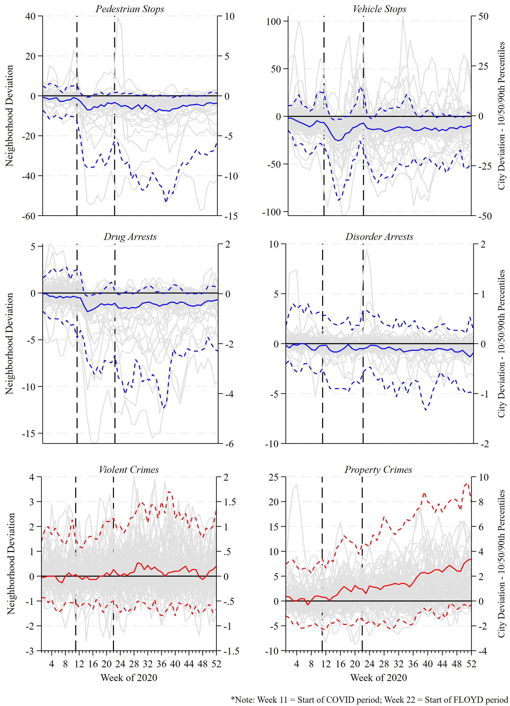

+++
# Paper title
title = "Drs. Nix & Huff: When police pull back: Neighborhood-level effects of de-policing on violent and property crime (Re-Blog)"

# Authors
authors = ["admin", "Jessie Huff", "Scott Wolfe", "David Pyrooz", "Scott Mourtgos"]

# Publication
publication = "*Criminology*"

# Publication types (2 = Journal article; 3 = preprint; 4 = report; 6 = book chapter)
publication_types = ["2"]

# Date this page was created.
date = 2023-10-05T11:00:00Z

# Project summary to display on homepage.
summary = ""

# Abstract
abstract = "Many U.S. cities witnessed both de-policing and increased crime in 2020, yet it remains unclear whether the former contributed to the latter. Indeed, much of what is known about the effects of proactive policing on crime comes from studies that evaluate highly focused interventions atypical of day-to-day policing, use cities as the unit of analysis, or cannot rule out endogeneity. This study addresses each of these issues, thereby advancing the evidence base concerning the effects of policing on crime. Leveraging two exogenous shocks presented by the onset of COVID-19 and social unrest following the murder of George Floyd, we evaluated the effects of sudden and sustained reductions in high-discretion policing on crime at the neighborhood level in Denver. Multilevel models accounting for trends in prior police activity, neighborhood structure, seasonality, and population mobility revealed mixed results. On one hand, large-scale reductions in stops and drug-related arrests were associated with significant increases in violent and property crimes, respectively. On the other hand, fewer disorder arrests did not affect crime. These results were not universal across neighborhoods. We discuss the implications of these findings in light of debates concerning the appropriate role of policing in the 21st century."

# Tags: can be used for filtering projects.
# Example: `tags = ["machine-learning", "deep-learning"]`
tags = ["Police", "Crime", "George Floyd", "Neighborhoods", "Violence", "COVID-19"]

# Optional external URL for project (replaces project detail page).
external_link = ""

# Slides (optional).
#   Associate this project with Markdown slides.
#   Simply enter your slide deck's filename without extension.
#   E.g. `slides = "example-slides"` references 
#   `content/slides/example-slides.md`.
#   Otherwise, set `slides = ""`.
slides = ""

# Links (optional).
url_pdf = ""
url_slides = "https://jnix.netlify.app/slides/acjs22/#1"
url_video = ""
url_code = ""

# Custom links (optional).
#   Uncomment line below to enable. For multiple links, use the form `[{...}, {...}, {...}]`.
links = [{name = "Preprint", url="https://doi.org/10.31235/osf.io/54dyh"}]

# Featured image
# To use, add an image named `featured.jpg/png` to your project's folder. 
[image]
  # Caption (optional)
  caption = "Image by [Michael Levine-Clark](https://flickr.com/photos/39877441@N05/) on [Flickr](https://flic.kr/p/2oKFUQ4), [CC BY-NC-ND 2.0 DEED](https://creativecommons.org/licenses/by-nc-nd/2.0/)"
  
  # Focal point (optional)
  # Options: Smart, Center, TopLeft, Top, TopRight, Left, Right, BottomLeft, Bottom, BottomRight
  focal_point = "Smart"
+++

**(Re-posted from Dr. Nix's [website](https://jnix.netlify.app/publication/55-crim-denver-depolicing/)). NOTE: This paper was originally posted as a pre-print on SocArXiv on March 3, 2023. On October 2, 2023, it was accepted for publication by** ***Criminology.*** **It is scheduled to appear in the February 2024 issue. In the meantime, you can download the pre-print using the button above.** 

**Background**

This paper started with [a tweet](https://twitter.com/jnixy/status/1356638491568967682) on February 2, 2021. I had retrieved open data from a handful of jurisdictions and plotted city-level trends in police stops and reported crimes before and after the onset of COVID-19 and the George Floyd protests. My colleague, David Pyrooz, took notice and reached out about doing a study on Denver. We quickly obtained more Denver data, looped Scott Wolfe in, and got to work. 

We published [this op-ed](https://www.denverpost.com/2021/02/24/denver-crime-rate-homicide-shooting-property-crime-police/) in *The Denver Post* once we were comfortable with our analysis of city-wide trends. As I recall, it was ... received.

We continued drilling down - ultimately to the neighborhood-week level. In doing so, we brought on my colleagues Jessie Huff and Scott Mourtgos to help with the analyses. It took two years but we finally completed a manuscript and submitted it to *Criminology*. After significant revisions (mostly cutting down the literature review and adding more robustness checks), it has been accepted for publication.

**The Problem**

There is ample evidence that [proactive policing](https://doi.org/10.1002/cl2.1302) can reduce crime. In 2020, there were two exogenous shocks to policing in Denver (and throughout the US) that caused significant reductions in policing: the onset of COVID-19 and the protests that occurred following the police murder of George Floyd in Minneapolis. And in 2020, many cities witnessed significant increases in violence. But to what extent was the former responsible for the latter? It turns out that much of what we know about the effects of proactive policing comes from studies that: (1) evaluate [temporary](https://link.springer.com/article/10.1007/s11292-019-09372-3), [focused interventions](https://doi.org/10.1111/1745-9133.12353) that don't resemble day-to-day policing, (2) use [cities](https://doi.org/10.1016/j.jcrimjus.2016.01.001) as the unit of analysis, and/or (3) can't rule out [endogeneity](https://doi.org/10.1371/journal.pone.0263777) (i.e., we want to know if policing affects crime, but have to account for the fact that crime affects policing).

**Our Method**

We examined the relationship between discretionary police behaviors and crime at the neighborhood level in Denver in 2020 (78 neighorhoods X 52 weeks = 4,056 neighborhood-weeks). We obtained crime, vehicular and pedestrian stops, and traffic collision (a proxy for public mobility) data from the [Police Data Initiative](https://www.denvergov.org/opendata/search?q=police). Arrest data were obtained directly from the [Denver Police Department](https://www.denvergov.org/Government/Agencies-Departments-Offices/Agencies-Departments-Offices-Directory/Police-Department). We also downloaded [Open Table Reservations](https://www.opentable.com/state-of-industry) as another proxy for public mobility (see e.g., [Leslie & Wilson, 2020](https://www.sciencedirect.com/science/article/pii/S0047272720301055)). Precipitation and temperature data came from [NOAA](https://www.ncdc.noaa.gov/cdo-web/datasets) to control for the potentially confounding influence of weather patterns. Similarly, we got Air Quality Index data from the [EPA](https://www.ncdc.noaa.gov/cdo-web/datasets). And finally, we constructed a measure of concentrated disadvantage using [ACS data](https://www.denvergov.org/opendata/dataset/american-community-survey-nbrhd-2015-2019). 

**Results**

The figure below shows weekly deviations in policing and crime across Denver's 78 neighborhoods in 2020. Grey lines correspond to the neighborhoods, whereas the red/blue lines represent the citywide 10th, 50th, and 90th percentiles, respectively. These deviations represent the number of stops/arrests/crimes that occurred each week in 2020 minus the number that occurred during that same week, on average, from 2016 to 2019. Positive values mean more, and negative values mean less stops/arrests/crimes in 2020 (see our Supplemental Appendix for more detail). All told, DPD made over 11,000 fewer pedestrian stops, 32,000 fewer vehicle stops, 3,000 fewer drug arrests, and 600 fewer disorder arrests. Meanwhile, there were an additional 528 violent crimes and 7,203 property crimes in 2020 - increases of 14.3% and 27.1%, respectively.

Mixed effects negative-binomial regression models showed that reductions in pedestrian stops and vehicle stops were associated with increases in violent crimes, while reductions in drug arrests were associated with increases in property crimes. Moreover, there was significant variation across neighborhoods. See Table 1 of the preprint (models displaying all controls are presented in Tables S5-S7). Our results were robust to several different model specifications - see pp. 2-3 of the Supplemental Appendix. 

**How Our Results Square with the Literature**

Our study adds to a growing number of studies in recent years that have documented the effects of sharp reductions in policing, including:

- [Shi (2009)](https://www.sciencedirect.com/science/article/pii/S0047272708001242) - Cincinnati
- [Rivera & Ba (2019)](https://scholarship.law.upenn.edu/faculty_scholarship/2109) - Chicago
- [Piza & Connealy (2022)](https://doi.org/10.1111/1745-9133.12570) - The CHOP Zone in Seattle
- [Ratcliffe & Taylor (2023)](https://doi.org/10.1016/j.jcrimjus.2023.102103) - Philadelphia
- [Weisburd (2021)](https://doi.org/10.1162/rest_a_00889) - Dallas

Of course, there are exceptions. See, for example, [Cho et al. (2021)](https://ssrn.com/abstract=4114411) and [Roman et al. (2023)](https://www.marcelroman.com/pdfs/wps/depol.pdf).

**In Conclusion**

I don't know that I can summarize it any better than we already did in the paper itself:

> Does de-policing lead to more crime? Denver’s 2020 experience suggests the answer depends on what “policing” means and how much of it was occurring in the first place. Proactive
stops appear to have a preventive effect on violent crime and drug-related arrests appear to have a similar effect on property crime. Notably, officers made ~32,000 fewer traffic stops in 2020 – a huge departure from the norm – and the reduction had a much smaller relationship with changes in crime than pedestrian stops. Police can likely reduce certain types of enforcement without disastrous consequences for crime, at least in the short term. As we continue to debate the role of policing, it is critical to understand the effects of various types of policing on crime and community. We hope such discussions are guided by sound evidence rather than emotion because the livelihoods of the public are at stake. 

