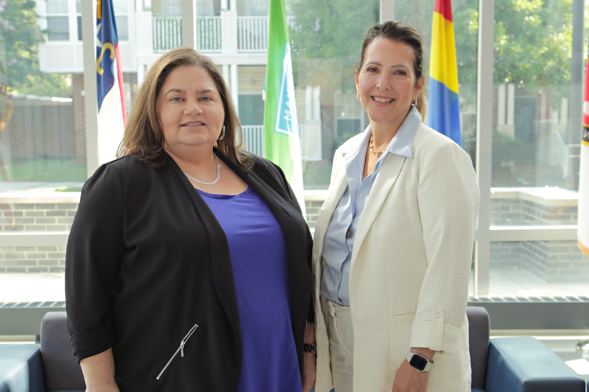

Over the past year, Dr. Huff has been a founding instructor for the American Society of Evidence-Based Policing (ASEBP) Applied Criminology & Data Management Course (AC/DC), funded by the National Institute of Justice. The AC/DC course was created to bring research-oriented police practitioners and academics together to conduct research projects that were valuable to the practitioners’ police agency. The requirement to complete a research project over the course of the program separates AC/DC from any other conference, working group, or training course. 

Participants represented fifteen police agencies and several universities from across the U.S. and Canada. The studies they produced have had direct benefits for the practitioners' police agencies. A brief of each study conducted can be found on the ASEBP [website](https://www.americansebp.org/ac_dc_course.php). 

Dr. Huff was assigned as a mentor for the Cincinnati Police Department, Dallas Police Department, Manchester Police Department, and the Philadelphia Police Department research teams. She is proud to have contributed to this program and cannot wait to see what the future holds for AC/DC and for all of those involved. Being able to see police practitioners and researchers come together to use research to improve the quality of policing has been one of the most rewarding experiences of her career.

The Cincinnati Police Department was represented by Lieutenant Jennifer Mitsch, who is the Director of the Greater Cincinnati Fusion Center and the Real Time Crime Center (RTCC). She partnered with Dr. Sherah Basham an Assistant Professor of Criminal Justice at the University of Tennessee at Chattanooga. Together, they chose to focus on an assessment of the Cincinnati Police Department’s RTCC. See this [summary](https://www.americansebp.org/docs/Basham_Mitsch.pdf) for more information about their project. 

The Dallas Police Department was represented by Sergeant Kellie Renfro, the departments Internet Crimes Against Children supervisor. She partnered with Dr. Kathleen Padilla, an Assistant Professor in the School of Criminal Justice & Criminology at Texas State University. Sergeant Renfro is the Dallas Police Department’s 30x30 Coordinator and wanted to use AC/DC as an opportunity to better understand the experiences of women police officers in Dallas. For more information about their project, see this [summary](https://www.americansebp.org/docs/Padilla_Renfro_Brief.pdf).

Lieutenant Matthew Barter, Chief of Staff of the Manchester Police Department, partnered with Assistant Professor Jon Bottema at the University of Southern Mississippi. Lieutenant Barter has been heavily involved in guiding violence reduction strategies in the Manchester Police Department. Through his research, Dr. Bottema has experience working with police intelligence officers and evaluating the implementation and utility of police intelligence. A natural partnership formed between the two, who chose to focus on crime gun intelligence. For more information about their project, see this [summary](https://www.americansebp.org/docs/Barter_Bottema.pdf).

Lieutenant Kelly Robbins from the Philadelphia Police Department partnered with Assistant Professor Eric Dlugolenski from Central Connecticut State University. Lt. Robbins currently serves as the Executive Officer for the Departments Chief Strategy Office and has been promoted to Captain. Dr. Dlugolenski is a former police sergeant from the West Haven Police Department Professional Standards Division. Lt. Robbins and Dr. Dlugolenski designed a study to use systematic social observation of body-worn camera footage to understand the relationship between procedural justice and coercion during pedestrian and traffic stops in Philadelphia.  

