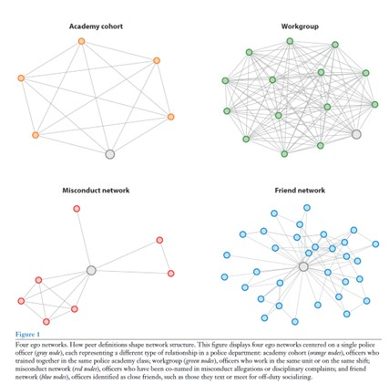

## 📊 Background: Why Study Social Networks in Policing?

Policing has long been described as a tightly knit occupation where officers rely heavily on one another. Classic research described a strong sense of solidarity, the so-called “blue brotherhood”, that shapes how officers interpret danger, make decisions, and respond to the public. Officers often work with the same people day after day, not only on the street but also off duty. Those they trained with at the academy, partner with on patrol, text during a shift, or meet for coffee. These relationships form the social fabric of policing and shape how officers learn the job, develop trust, and decide how to respond in uncertain situations. 

Yet most research on policing has traditionally treated officers as individuals rather than as members of interconnected social groups. Network research shifts the focus to relationships themselves, who works together, who trains together, and who socializes together. Drawing on recent studies using social network analysis, this review details how these connections influence a variety of outcomes, from misconduct and use of force to officer well-being and retention.

## 🔬 Mapping the Social Structure of Police Departments

To study these relationships systematically, researchers use social network analysis. Network analysis examines how individuals are connected and how those connections influence behavior, attitudes, and other outcomes. Instead of treating officers as independent, this approach focuses on the web of relationships that links them together. At its core, network analysis is built from two elements: nodes, representing actors in the system – such as individual officers, work units, or entire agencies, and edges, representing the ties between them, such as working the same assignment, responding to the same call, or socializing off duty.  

Mapping these ties makes it possible to see patterns that are difficult to detect using traditional approaches. Network analysis can identify officers who occupy influential positions, such as those who connect otherwise separate groups, those who sit at the center of tightly knit clusters, or those who are repeatedly involved in the same incidents as others. These positions matter because they shape how information, expectations, and norms spread through a department. An officer who bridges different groups, may carry norms from one unit to another, while members of close-knit clusters may reinforce each other’s attitudes through repeated interaction. In this way, network analysis provides a way to understand policing as a social system in which relationships help determine how officers learn the job, respond to risk, and make decisions in the field.  

In policing, ties can come from many sources: officers may attend the academy together, work on the same shift, respond to the same calls, or form close friendships inside work. Each type of relationship captures a different layer of the organization, and choosing which layer has real consequences for what gets seen.

Figure 1 illustrates this directly by mapping four networks centered on the same officer: academy cohort classmates, workgroup partners, misconduct co-complainants, and close friends. The resulting structures look very different. Academy and workgroup networks appear dense and uniform, while misconduct networks clusters around specific incidents, and friendship networks are more varied cutting across ranks and assignments. Notably, very few ties overlap across these networks, with only a single colleague in both the officer’s academy cohort and friend networks, with no single colleague appearing across all four. A study relying on any one of these sources alone would be describing a fundamentally different social world.

## 💡 What Network Research Shows About Police Behavior

Studies using network data consistently show that behaviour tends to cluster within officers’ social ties. Misconduct, use of force, and other high-risk incidents often appear within small groups of officers who are connected to one another, and officers connected to colleagues with histories of force or misconduct are more likely to experience similar outcomes themselves.

At the same time, not all peer effects are negative. Some studies find that exposure to experienced peers can reduce the likelihood of certain types of force, suggesting that networks can reinforce restraint as readily as they can reinforce aggression. Research using longitudinal network data further shows that influence works in both directions. Officers become more similar to the people they spend time with, but they also seek out friends who already share their attitudes or behaviours. The combination of influence and selection may help explain why certain patterns persist within small groups even when department-wide policies change. 

Peer effects also vary across departments, types of ties, and outcomes studied. A multi-department study across seven New Jersey agencies found wide variation in how use-of-force networks were structured, a finding that cautions against assuming any single pattern holds universally.

## 🎯 Why a Network Perspective Matters

Viewing police departments as networks rather than collections of independent individuals has important implications for both research and policy. Changing who works together, who trains together, or who mentors new recruits may influence outcomes across an entire organization. Network mapping can help identify tightly connected groups, highly influential officers, and isolated officers, all of which may affect how norms develop and spread.

So far, most network research in policing has focused on misconduct and use of force, in part behavior those behaviours are easier to map using relational information embedded in administrative records. But the same approach can also be used to study officer well-being, recruitment, and the adoption of new policies, among others. Social ties can transmit harmful behaviour, but they can also provide support, mentorship, and protection against stress. Understanding both sides of these relationships is essential for building healthier and more effective organizations. By bringing relationships to the forefront, network research offers a more complete picture of how policing works, and where it can change.

{}
A version of this blog was first published online in [Research Connections Issue 25](https://www.sfu.ca/content/dam/sfu/criminology/Documents/ResearchConnectionsArchive/20260330_ResearchConnection_Issue25.pdf), *School of Criminology, Simon Fraser University.* Burnaby, B.C.
{}

