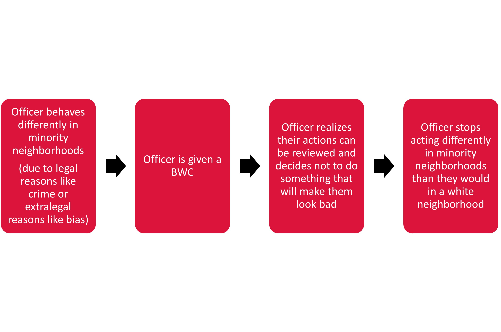

As an MA student in 2014, I watched protesters advocate for police reform to address racial/ethnic disparities after the death of Michael Brown at the hands of the police in Ferguson, Missouri. One of the most commonly proposed reforms was the adoption of police officer body-worn cameras (BWCs). At the time, BWCs were a relatively new technology, just beginning to be evaluated in a few places across the UK. Nevertheless, questions about the events that led to Michael’s death became inextricably tied to calls for police departments to equip their officers with cameras. This seemed to be based on the presumption that this technology could prevent these events in the future. The question that kept me up at night was: why? Why would strapping a camera to an officers’ chest reduce racial/ethnic disparities in policing? And, if there are reasons to believe that this technology would reduce disparities, can we prove it? I attempted to answer these questions in a recently published paper in *Criminology & Public Policy*. The full results are freely available [here](https://onlinelibrary.wiley.com/doi/10.1111/1745-9133.12590), but I want to use this space to talk about the major findings in a different way.

**Question 1: How might BWCs reduce racial/ethnic disparities in police behavior?**

I am not aware of a short, eloquent answer to this question, but I will do my best to summarize my thoughts here. Police practitioners and scholars alike recognize the centrality of discretion to understanding police behavior. Namely, in most situations, officers have a choice about how to achieve their job function (whether that choice is to stop someone, conduct an arrest, or use force). There has been a ton of research examining the factors that predict officer choices, finding that factors associated with the individual situation, the responding officer, and the location in which that situation takes place all influence the decision-making process. There are two relevant areas of discussion for understanding whether BWCs can reduce disparities in minority neighborhoods: 1) explanations for why policing varies depending on neighborhood racial/ethnic composition, and 2) how technology designed to enhance transparency and accountability of officer decisions can change police behavior.

Explanations for how race/ethnicity influences officer decisions include perspectives on the use of social control to address perceived racial/ethnic threats and to defend white neighborhoods. These theoretical explanations largely indicate that officers will use more authority in minority communities (i.e., over-enforcement). Alternatively, some theories suggest that officers will use less authority in minority neighborhoods because they are not as motivated to protect minority victims (i.e., under-enforcement). Still others suggest that police behavior is unrelated to neighborhood racial/ethnic composition itself, but is rather driven by crime. Whichever explanation helps you sleep at night is fine for the moment, so long as we agree that research has identified differences in police behavior in minority communities.

Next, the question becomes how BWC technology could eliminate differences in police behavior in white and minority neighborhoods. BWCs take what has historically been a very private interaction between a police officer and a civilian and makes video footage readily available for others to watch. This is suggested to change the way officers behave through a self-awareness effect (the officer realizes “someone could watch the interaction play out”) and a deterrence effect (therefore, “I better not screw this up”). 

To put these things together, the expected relationship between BWCs and eliminating racial/ethnic disparities in police behavior seems to follow this pattern:

All of this is fine and good, but the crucial question is whether it actually plays out in practice.

**Question 2: Do BWCs reduce racial/ethnic disparities in police behavior?**

I was fortunate to work with the Phoenix Police Department on an [evaluation](https://link.springer.com/article/10.1007/s11292-020-09448-5) of their BWC program from 2015 to 2018, collecting 18 months of data pre-BWC deployment and 18 months of data post-BWC deployment.[^1] To answer this question, I first examined whether arrests and use of force varied across minority neighborhoods before BWCs were deployed to randomly selected officers.[^2] Relative to white neighborhoods, the odds of an arrest were 21% higher in Hispanic neighborhoods and 75% higher in Black neighborhoods before cameras were deployed. Use of force, however, was not significantly associated with neighborhood racial/ethnic composition prior to BWC deployment.

Next, I examined whether these patterns remained stable in the 18 months after BWCs were deployed to randomly selected officers.[^3] The arrest results held, indicating that the odds of arrest were 59% higher in Hispanic neighborhoods and 82% higher in Black neighborhoods, compared to white neighborhoods. Use of force was not significantly associated with neighborhood percent Black or Hispanic after BWCs were deployed either. However, this approach only examines whether randomly giving some officers BWCs changed patterns of enforcement for *all officers in the Phoenix Police Department*. To determine whether BWCs could truly reduce disparities in police behavior, I examined whether the influence of neighborhood racial/ethnic context on arrest and/or use of force depends on *whether a BWC was actually turned on during that particular incident*. In the case of arrests, there was no significant relationship between BWC activation and neighborhood percent Hispanic. However, the odds of an arrest occurring in a Black neighborhood were *38% lower* when a BWC was activated. This suggests that BWCs are changing officers' propensity to arrest in Black neighborhoods. Finally, and probably unsurprisingly at this point, there were no significant relationships between BWC use and neighborhood percent Hispanic or neighborhood percent Black on use of force. 

**The takeaways**

In short, these results suggest that BWCs have a nuanced influence on police behavior in minority communities. BWC activation reduced the odds of arrest in Black neighborhoods (though not Hispanic neighborhoods). Further, use of force did not differ across neighborhoods either before or after BWCs were implemented. Based on these results, police agencies seeking to reduce racial/ethnic disparities should not rely on BWCs alone to achieve this goal.
The different influence of BWC activation on arrests in Hispanic and Black neighborhoods could be due to different factors that drive arrests in these places. For example, if the higher odds of arrest in Black neighborhoods is due to the neighborhood racial context itself, BWC use could eliminate this relationship because officers are more aware of the potential for their decisions to be reviewed and could turn to alternative resolutions. If the higher odds of arrest in Hispanic neighborhoods is driven by legally relevant differences in the types of incidents that occur in these neighborhoods, BWCs are unlikely to change these patterns. Of course, all of this is speculative.

Although BWCs are often framed as a mechanism for changing police behavior, less attention has been given to the potential for this technology to influence civilian responses to the police. Researchers have found that support for the police differs across racial/ethnic groups. These differences could also lead to differential impacts of BWCs in different neighborhoods *if civilians in different places react to BWCs in different ways*. For example, individuals in Black neighborhoods could become hesitant to cooperate with the police or provide evidence that could facilitate an arrest to avoid being deemed a snitch (which could be perceived as more likely to occur if a BWC is used), while BWCs might have little impact on police cooperation in Hispanic neighborhoods with different codes of the street.

It would also be impossible to disentangle these results from the context they came from. Phoenix is situated in Maricopa County, home to former Sheriff Joe Arpaio. The Maricopa County Sheriff’s Office was nationally recognized for taking a hard stance on immigration enforcement which has resulted in strained relationships between the police and Hispanic communities in the area (even though the sheriff’s office and the Phoenix Police Department are distinct police entities). These strained relationships could still influence civilian reactions to the police, if individuals in Hispanic neighborhoods are more likely to resist or behave in other ways that could increase the need for officers to conduct an arrest. 

Like most research, these results provide some answers, but also point toward many more questions.[^4] Future studies should directly examine the impact of BWCs on police interactions with civilians from different racial/ethnic backgrounds. Further, these results suggest that BWC implementation is not enough to eliminate disparities in minority neighborhoods. But, using the vast and rich information that can be gathered from BWC footage to identify why arrests are used differently in minority neighborhoods could help police leaders craft policies to minimize those differences. 

[^1]: I cannot thank the Phoenix Police Department enough for their partnership through this process. Several other publications and projects have come out of these data. If you are interested in the general effects of BWCs I am happy to share those papers.
[^2]: I will spare you the gory details, but I used a statistical model that allowed me to account for a ton of different situational, officer, and neighborhood factors that also contribute to officer decisions to conduct arrests and use force (for example, I look at offense type, officer race/ethnicity, officer years of service, neighborhood violence rates, etc.). As a result, all of the findings I present here can be considered the unique effect of neighborhood racial/ethnic context on arrests and use of force, or in other words, the effect of neighborhood racial/ethnic context on arrests and use of force net of other situational, officer, and neighborhood influences. 
[^3]: I also looked at the direct influence of BWC activation on arrests and use of force to examine whether having any BWC activated changed officer behavior. I additionally accounted for whether the responding officer was assigned to wear a BWC (regardless of whether they actually turned it on). Both measures were associated with arrests and use of force.
[^4]: Although it would be lovely to answer every possible question related to this topic, future research questions do tend to keep us academics in business.
