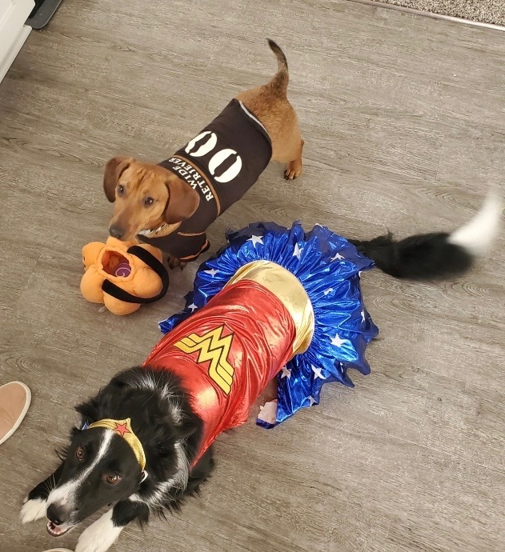

# [Brenna Dunlap](https://www.viprlab.org/author/brenna-dunlap/) 

I am a first year Ph.D. student working as a research assistant under Dr. Jessie Huff. Currently, we are evaluating a restorative justice program at a local police department and working on an in-depth assessment of neighborhood influences on police use of force. My research interests outside of my assistantship include police use of force, procedural justice, and evidence-based policing. 
 
Before starting this program, I earned my BA and MA at Saint Louis University. I am still working on multiple projects with Dr. Joseph Schafer involving gender differences in policing, stress and coping among female officers, and improving responses to trauma in officers. 
 
Outside of school I enjoy sports, traveling, and anything outdoors. Recently, I’ve been running half marathons, weightlifting, and playing softball. I also spend a lot of time with my dog, Noodles, taking her for walks around Omaha.

# [Trey Bussey](https://www.viprlab.org/author/preston-trey-bussey/) 

Trey at the Grand Canyon

I am a first-year Ph.D. student, currently working as a research assistant under Dr. Justin Nix. We are evaluating police officer de-escalation training and citizen interaction outcomes. This project is funded by the National Institute of Justice and is coordinated between multiple universities and police departments.
 
Before starting this program, I earned my BS and MS at Radford University in Virginia. I served as a teaching fellow and taught undergraduate classes during graduate school. Teaching classes was a rewarding experience and influenced my decision to pursue a Ph.D. Upon completing this program, my goal is to become a professor and continue teaching. 
 
As an MS student, I focused on crime analysis training. I planned on becoming a crime analyst before deciding to obtain a Ph.D. Despite my change in career aspirations, I am still working on crime science research. My research is focused on evidence-based policing and proactive crime reduction strategies. I am also interested in police use of force and how police training can improve police-citizen interactions.  
 
Moving to Nebraska has been an interesting change, but I like it here! Some of my interests outside of school include weightlifting and training in Brazilian Jiu-Jitsu. I am also a certified personal trainer. I try to stay active during my free time and I think fitness improves other aspects of my life.

# [Natalie Cotton](https://www.viprlab.org/author/natalie-cotton/)

Natalie about to crank a homerun

I am a first-year MA student, currently working as a research assistant under Dr. Sadaf Hashimi. We are planning on working together on gangs and network analysis, and we are working on a DHS-funded project that seeks to better understand [screening and hiring practices in policing](https://www.viprlab.org/post/21-11-23-dhs-insider-threats/). My research interests revolve around group crime and the connections between the actors involved. 

As an undergrad, I studied criminal justice at University of Nebraska Kearney and University of Nebraska Omaha. I originally majored in political science with a plan to go to law school, but my interests gradually shifted toward the criminal justice system. My undergrad Gangs and Gang Control class ultimately inspired me to pursue an MA degree.

When I am not at school, I like to stay active. I enjoy weightlifting, boxing, and taking my husky for walks. I have played softball most of my life, and I even played at the collegiate level during my time at UNK. I also really like to read and write. I work at Target on the weekends, where I have worked for the last five years. Between school and work, it can be hard to find free time, but staying active is a priority and I try to spend one or two hours a day involved in fitness. 

# [Sarah Al Falatah](https://www.viprlab.org/author/brenna-dunlap/sarah-al-falatah) 

I am a second-year MA student, currently working under the supervision of Dr. Sadaf Hashimi. Currently, we are working on a project with the Behavioral Health and Wellness Unit at the Omaha Police Department aimed at better understanding suicide-related police calls for service. My research interests are focused on mental health and the criminal justice system as well as the intersectionality of neuroscience and criminology.

Before moving to Omaha, I was an undergraduate student at the University of South Florida. I majored in biomedical sciences and minored in criminology. Originally, I planned on attending medical school, but after minoring in criminology and working on my undergraduate thesis I knew I was most passionate about criminology. 

Moving to Omaha has been great! When I’m not busy at school I like to spend time outdoors, especially during the warm summer. I have two cats, Mila and Magnus, and I also have a dog, Max. My three pets bring me a lot of joy and keep me busy, since one of them is always getting into trouble. I love to cuddle up at home with them and read a book or watch a movie. 

# [Rachael Rief](https://www.viprlab.org/author/rachael-rief/)  

I am a Ph.D. Candidate. I am currently a part of the research assistantship program at the National Institute of Justice where I have gotten to help organize and facilitate a symposium on the results of a 2020 recidivism forecasting challenge. I also worked on a review of the Challenge winner's methods. I am working on a research note examining gender responsivity and racial bias in risk assessment tools which was framed by discussions at the symposium. During my time at NIJ, I have also been able to work with agencies like the International Criminal Investigative Training Assistance Program, assisting them with the understanding of a standardized project design model. 

At UNO, I have mostly done research related to women in policing, and have published my findings in *Police Quarterly*, *Criminal Justice and Behavior*, *Feminist Criminology*, and an edited volume on *Rethinking and Reforming American Policing* (Schafer & Myers, Eds.). I would like to conduct more research on recruitment and training practices (i.e., academy and field training procedures) and how they impact the ability to attract and retain female officers. In recently collected qualitative data, policewomen discussed with me various issues that arose during their field training and academy, like negative experiences with training officers. I seek to apply an intersectional lens to this line of research. 

When I am not working, you can find me doing some outdoor activity with my dogs, shown below in their Halloween costumes 😄. I also have a cat. My border collie keeps me very busy. I am always trying to find new ways to expend her energy. One of my favorites things to do with her is exploring different walking trails around Omaha. 

Rachael's dogs getting in on the Halloween fun

