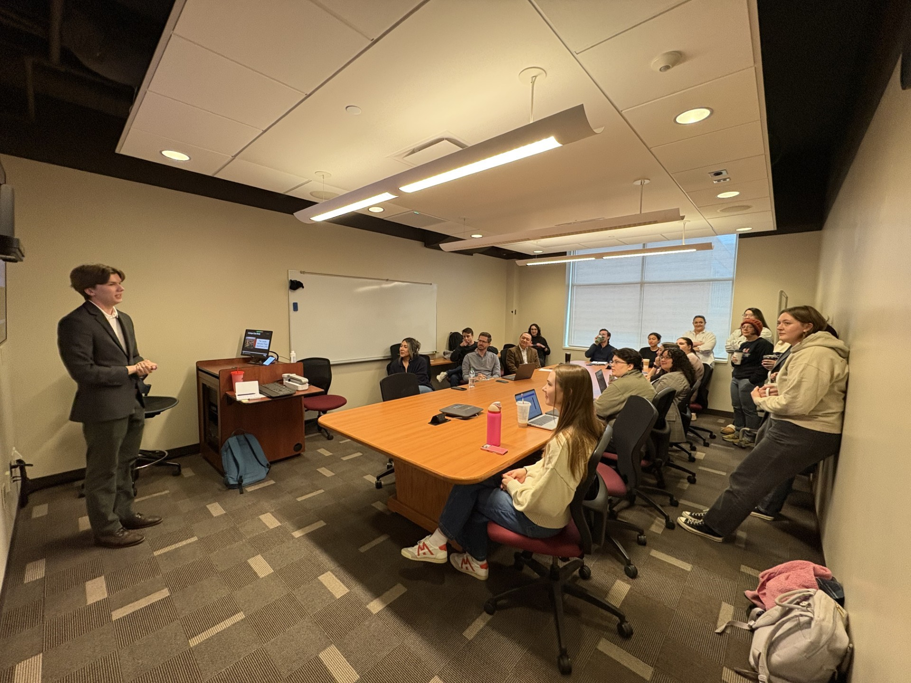

[Jordan Cline](https://www.viprlab.org/author/jordan-cline/) successfully defended his thesis, *The Effects of a Traffic Enforcement Team: A Case Study*, this morning. Using publicly available data from the Lincoln Police Department, he ran ITSA models to estimate the effects of staffing reductions in the Traffic Enforcement Unit on stops and stop outcomes. 

During the defense, it was standing room only!

Next up for Jordan: PhD. Stay tuned for more great work from him...