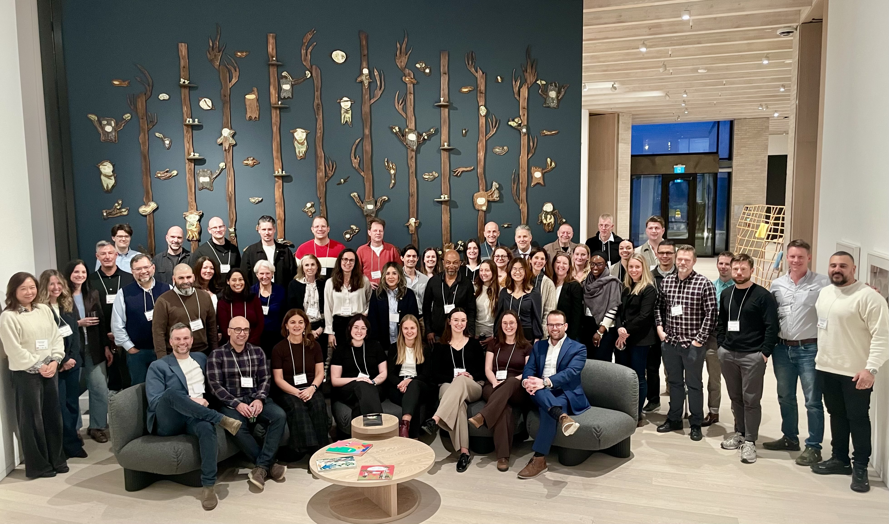

[Dr. Hashimi](https://www.viprlab.org/author/sadaf-hashimi/) recently attended the 23rd Eurogang Workshop, held March 11–13, 2026, at Simon Fraser University in Burnaby, British Columbia, Canada. The workshop brought together an international community of scholars, students, and practitioners to engage with this year’s theme, “Gangs and Guns: What Policymakers Need to Know.”

The Eurogang Network is a longstanding international research collaboration focused on advancing the study of gangs and group processes across countries and contexts. The annual workshop serves as a key space for sharing new research, building comparative insights, and strengthening connections between research, policy, and practice.

This year's program featured a wide range of panels on topics including cross-national perspectives and evidence-based approaches to understanding gang involvement, violence, and pathways into and out of the justice system. The event also brought together both researchers and practitioners, reflecting a shared commitment to informing policy and intervention efforts.

For more on Eurogang, please visit their [website](https://eurogangproject.com/eg-workshops/).