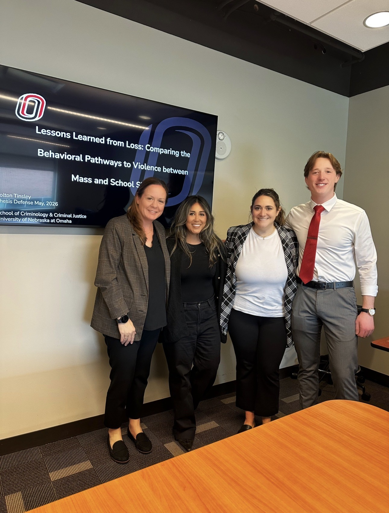

[Colton Tinsley](https://www.viprlab.org/author/colton-tinsley/) successfully defended his thesis, *Lessons Learned from Loss: Comparing the Behavioral Pathways to Violence Between Mass and School Shooters*, yesterday. Using publicly available data from school and mass shooting databases, he ran multiple logistic regression models to estimate the correlates of fatal mass shootings, K-12 shootings, and upper education shootings.

Colton drew quite the crowd to come see his work, both in person and online.

Next up for Colton: PhD. Stay tuned for more great work from him...