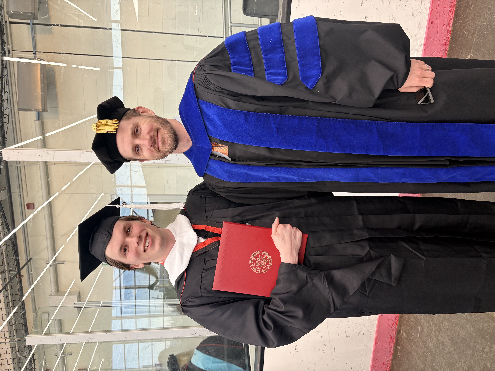
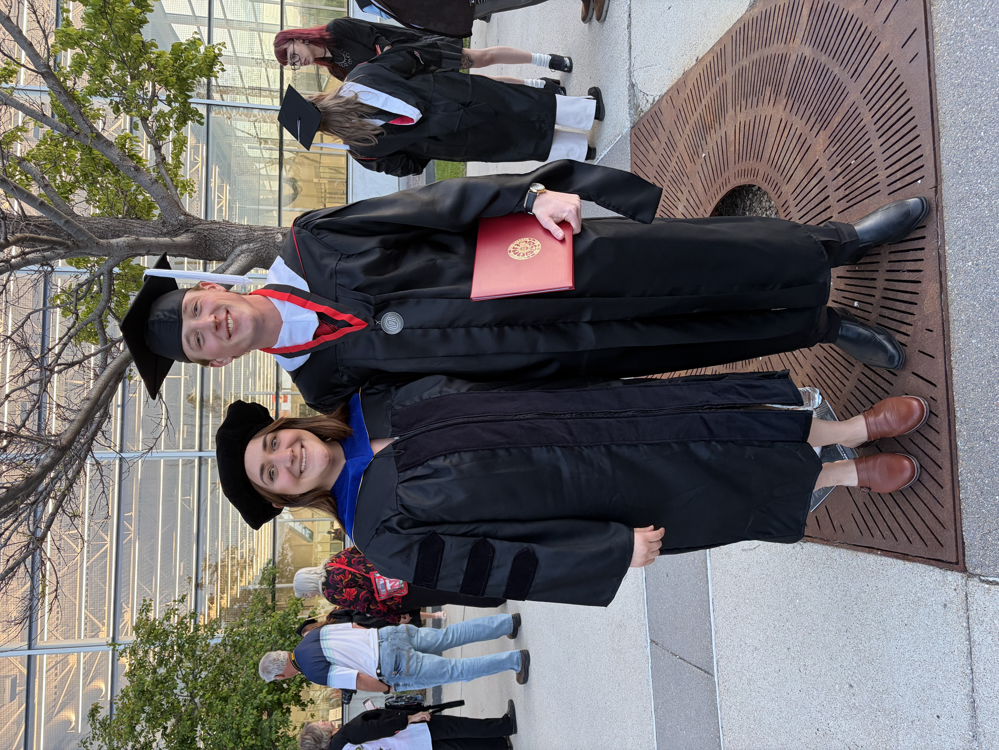
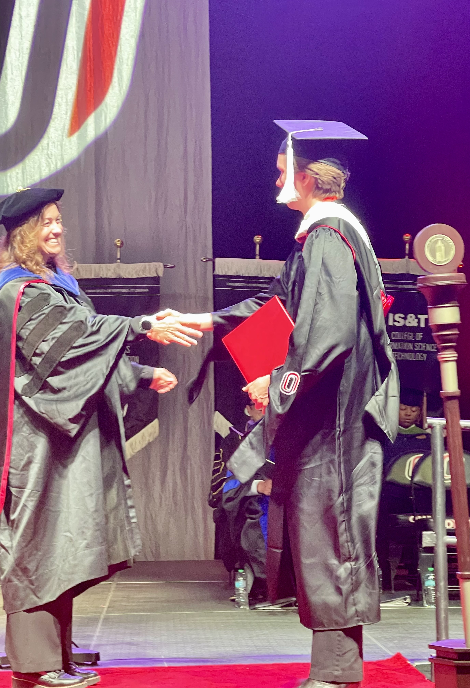
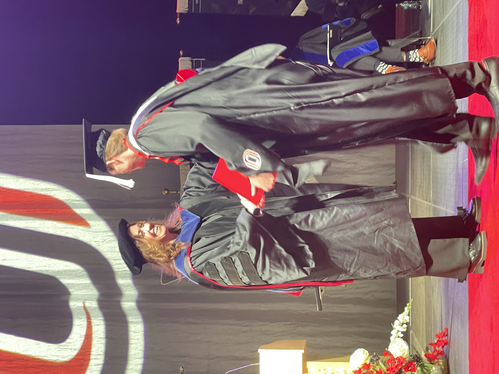

Congratulations to our graduating M.A. students, [Jordan Cline](https://www.viprlab.org/author/jordan-cline/) and [Colton Tinsley](https://www.viprlab.org/author/colton-tinsley/), on successfully completing their theses and earning their master’s degrees!

We are proud to celebrate their hard work and accomplishments alongside their thesis chairs, [Drs. Justin Nix](https://www.viprlab.org/author/justin-nix/) and [Jessica Deitzer](https://www.unomaha.edu/college-of-public-affairs-and-community-service/criminology-and-criminal-justice/about-us/jessica-deitzer.php). We are especially excited that both Jordan and Colton will continue their academic journeys in our Ph.D. program, and we look forward to seeing all they accomplish in the years ahead.

Here are a few photos from graduation as we celebrate this outstanding achievement. Please join us in congratulating Jordan and Colton!

  

  

  

  

